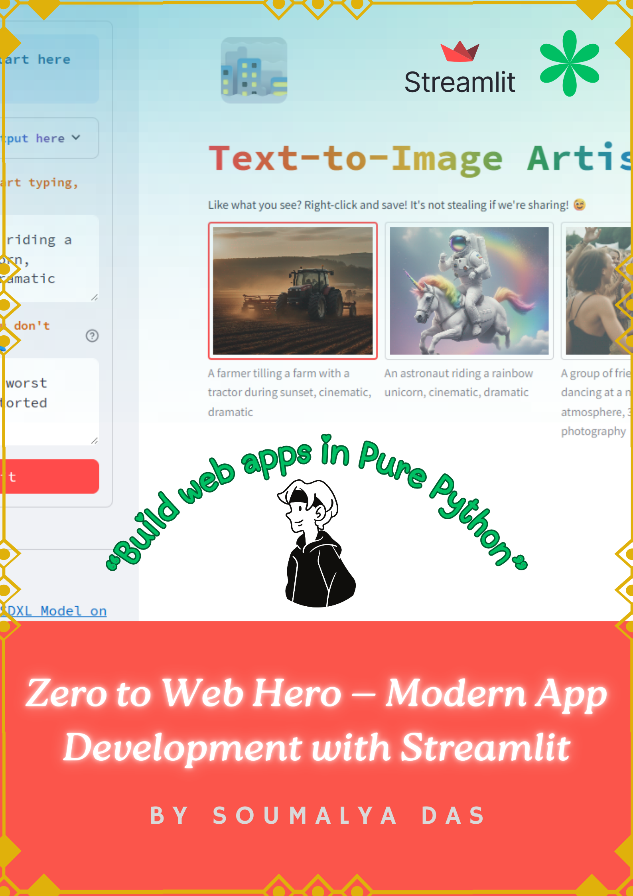

# 🚀 Streamlit Mastery: Build C00L Data Science Apps

Welcome to the ultimate guide for creating **interactive, high-quality data science applications** using **Streamlit**, the Python library that transforms scripts into web apps in minutes.

This repository is designed to help developers, data enthusiasts, and beginners alike to:

- ✅ Learn Streamlit from scratch
- ✅ Build interactive dashboards and apps
- ✅ Integrate data visualizations, charts, and media
- ✅ Deploy apps effortlessly to share with the world

### 📚 What You'll Learn

- **Setting up Streamlit** on your system
- **Creating dynamic apps** with widgets, buttons, and inputs
- **Visualizing data** with popular Python libraries like Pandas, Matplotlib, Plotly, and Seaborn
- **Handling media**: images, videos, and audio
- **Deployment tips** for sharing your apps online
- ...and much more!

### ⚠️ Note

The commands and instructions in this guide are based on **Windows Terminal**. Users on **macOS** or **Linux** may need to adjust commands accordingly.

### 🤝 Contribute

Feel free to fork the repo, submit pull requests, or suggest new features. Together, we can make the Streamlit community even stronger!

Happy coding and creating C00L apps! 💻✨
